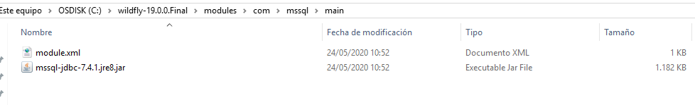

Creación Datasource wildfly Windows
~~~~~~~~~~~~~~~~~~~~~~~~~~~~~~~~~~~
* Para crear el datasource es necesario descargar el driver de la siguiente página:
https://mvnrepository.com/artifact/com.microsoft.sqlserver/mssql-jdbc/7.4.1.jre8

* Cuando tenemos el driver (jar) se debe crear un archivo llamado module.xml con el siguiente contenido:

[source,xml]
-----------------
<?xml version='1.0' encoding='UTF-8'?>

<module xmlns="urn:jboss:module:1.1" name="com.mssql">
    <resources>
        <resource-root path="mssql-jdbc-7.4.1.jre8.jar"/>
    </resources>
    <dependencies>
        <module name="javax.api"/>
        <module name="javax.transaction.api"/>
    </dependencies>
</module>"
-----------------
* Estos dos archivos se deben ubicar en la siguiente ruta:

* Luego se debe crear el driver JDBC en configuration-> Subsystems -> Datasources & Drivers -> JDBC Drivers

* Estos son los atributos que se deben configurar

* Para configurar el datasource se debe hacer clic en la siguiente ruta Subsystems -> Datasources & Drivers -> Datasources

* Se selecciona el template

* Se pone el nombre del datasource

* Seleccionar el driver

* Luego se pone los datos de conexión de la base de datos

* En esta sección se puede testear la conexión

* Se valida los datos de conexión

image::images/ds11.PNG[width=80%]

* Se valida que el datasource esta habilitado

Creación Datasource wildfly Linux
~~~~~~~~~~~~~~~~~~~~~~~~~~~~~~~~~

* Para crear el datasource es necesario descargar el driver de la siguiente página:
https://mvnrepository.com/artifact/com.microsoft.sqlserver/mssql-jdbc/7.4.1.jre8

* Luego se debe ejecutar el siguiente comando donde esté el archivo  jboss-cli.sh para crear el módulo

[source,python]
-----------------
module add --name=com.mssql--resources=/tmp/mssql-jdbc-7.4.1.jre8.jar --dependencies=javax.api,javax.transaction.api
-----------------
* Para crear el Driver

[source,python]
-----------------
/subsystem=datasources/jdbc-driver=mssql:add(driver-name="mssql",driver-module-name="com.mssql",driver-class-name=com.microsoft.sqlserver.jdbc.SQLServerDriver)
-----------------

* Para crear el datasource

[source,python]
-----------------
data-source add --jndi-name=java:/santander --name=santander --connection-url=jdbc:sqlserver://sqlserversantander.database.windows.net:1433;DatabaseName=chatbot --driver-name=mssql --user-name=user --password=password
-----------------