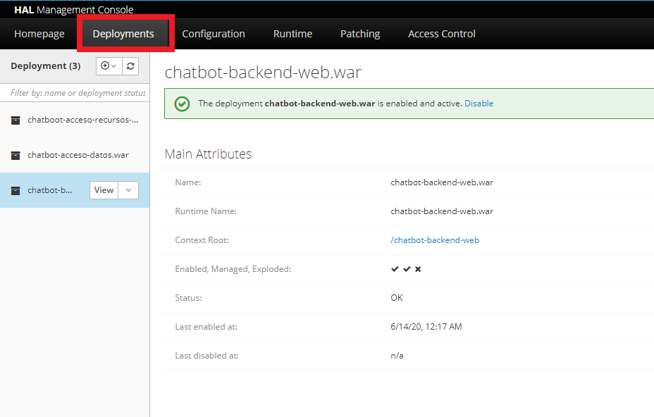
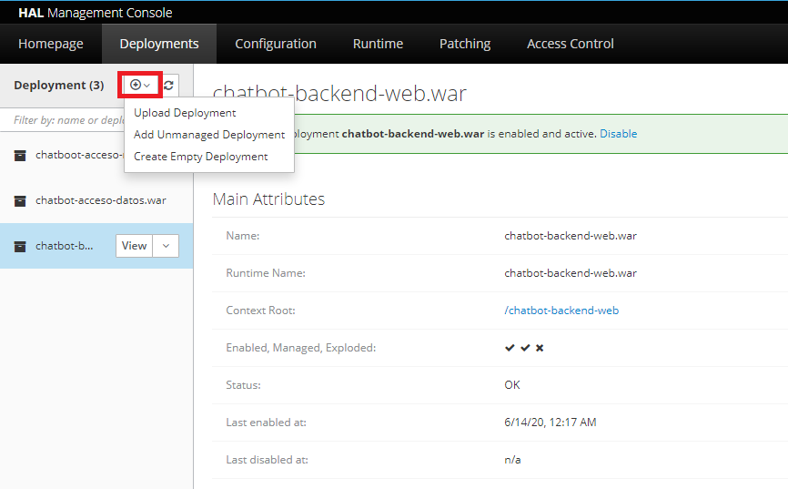
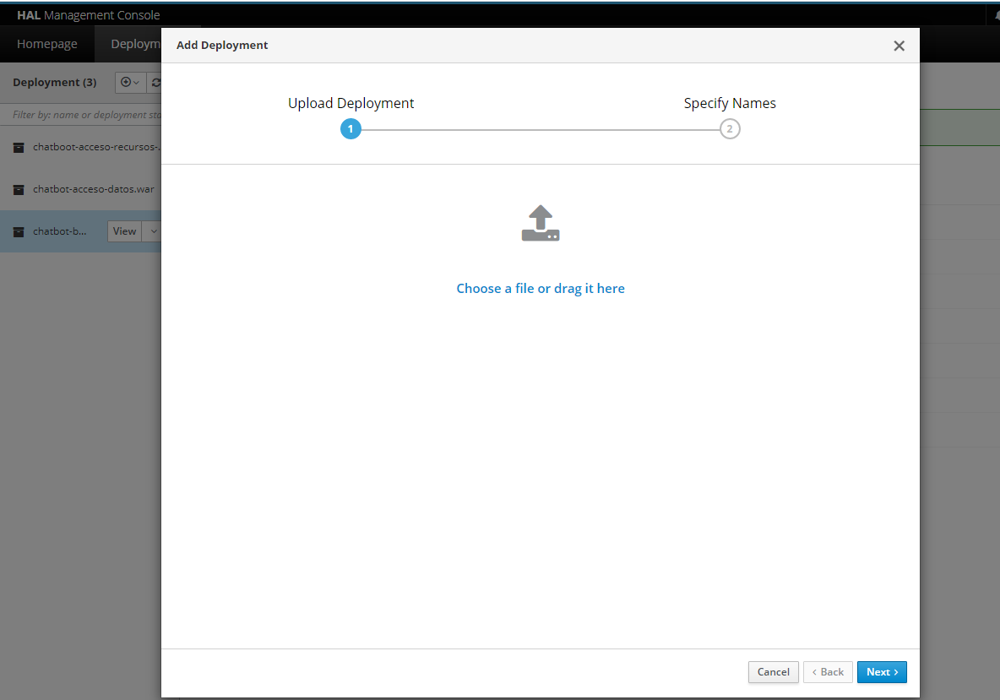
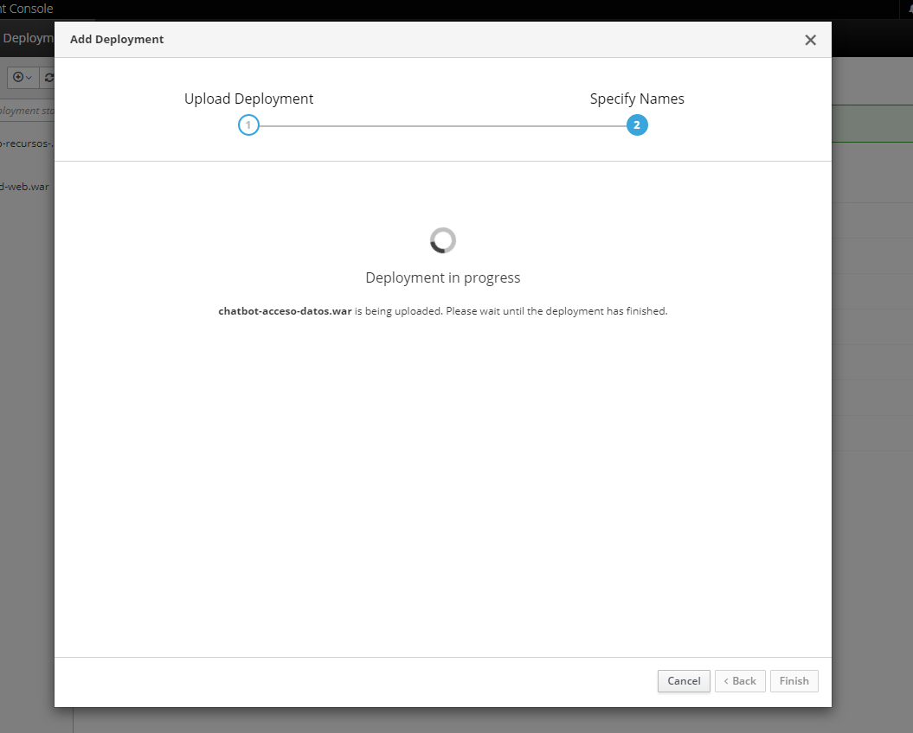
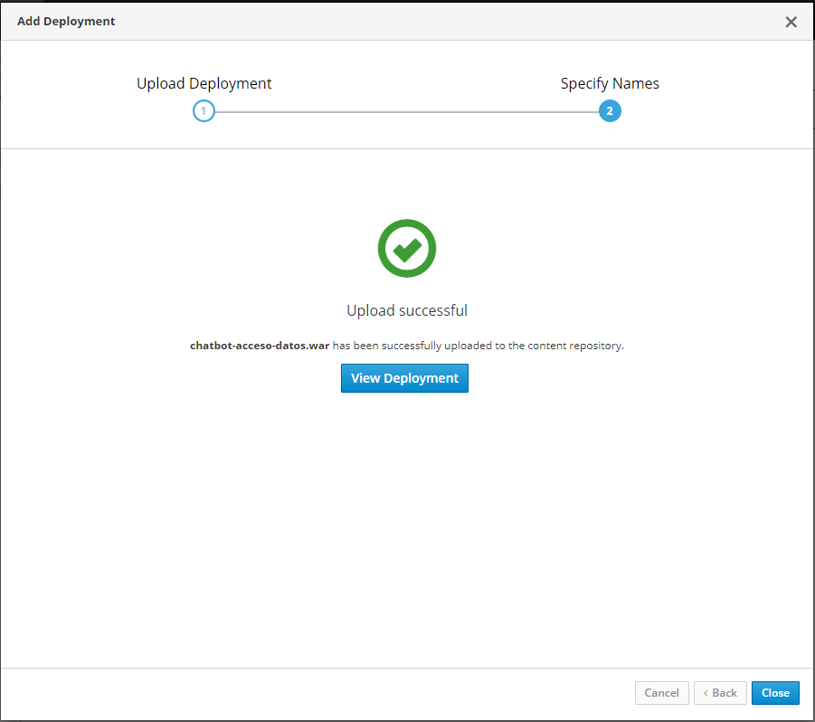

= Documentación

Generación certificado
~~~~~~~~~~~~~~~~~~~~~~

para crear el certificado autofirmado debemos usar las herramientas que provee la herramienta keytool de java. para hacerlo se debe escribir el siguiente comando:

[source,python]
-----------------
keytool.exe -genkeypair -keyalg RSA -keysize 2048 -storetype PKCS12 -keystore santanderbot.p12 -validity 365
-----------------

A continuación se debe llenar los campos que solicita la herramienta

[source,python]
-----------------
Introduzca la contraseña del almacén de claves:
Volver a escribir la contraseña nueva:
¿Cuáles son su nombre y su apellido?
  [Unknown]:  localhost
¿Cuál es el nombre de su unidad de organización?
  [Unknown]:  santander
¿Cuál es el nombre de su organización?
  [Unknown]:  santander
¿Cuál es el nombre de su ciudad o localidad?
  [Unknown]:  bogota
¿Cuál es el nombre de su estado o provincia?
  [Unknown]:  bogota
¿Cuál es el código de país de dos letras de la unidad?
  [Unknown]:  CO
¿Es correcto CN=localhost, OU=santander, O=santander, L=bogota, ST=bogota, C=CO?
  [no]:  si
-----------------

La contraseña para este certificado es changeme

Ejecución Sonar
~~~~~~~~~~~~~~~~
Para ejecutar sonar primero debemos iniciar un contenedor de docker con sonar.

Docker
~~~~~~
[source,python]
-----------------
docker run -d --name sonarqube -p 9000:9000 -p 9092:9092 sonarqube
-----------------
Usuario: admin
Password: admin

MVN
~~~
Luego se debe ejecutar el siguiente comando en el proyecto
[source,python]
-----------------
mvn sonar:sonar -Dsonar.host.url=http://localhost:9000
-----------------

Manual de despliegue
~~~~~~~~~~~~~~~~~~~~~

* *Precondiciones*

Se debe tener instalado _java 1.8_ y _maven_. Adicional

Versión de Java en el que se realizo el desarrollo:
------------------------------
java version "1.8.0_211"
Java(TM) SE Runtime Environment (build 1.8.0_211-b12)
Java HotSpot(TM) 64-Bit Server VM (build 25.211-b12, mixed mode)
------------------------------

Versión Maven en el que se realizo el desarrollo:
---------------------------
Apache Maven 3.6.1 (d66c9c0b3152b2e69ee9bac180bb8fcc8e6af555; 2019-04-04T14:00:29-05:00)
Maven home: C:\apache\apache-maven-3.6.1\bin\..
Java version: 1.8.0_211, vendor: Oracle Corporation, runtime: C:\Program Files\Java\jdk1.8.0_211\jre
Default locale: es_CO, platform encoding: Cp1252
OS name: "windows 10", version: "10.0", arch: "amd64", family: "windows"
---------------------------

* *Compilacion del proyecto*

Ejecuta el siguiente comando *_mvn clean install_* (Se debe tener en cuenta que se debe estar en el home del proyecto)

[TIP]
====
<home_proyect>/chatbot-backend/
====

------------------------
[INFO] ------------------------------------------------------------------------
[INFO] Reactor Summary for chatbot-backend 1.0.0:
[INFO]
[INFO] chatbot-backend .................................... SUCCESS [  0.484 s]
[INFO] chatbot-domain ..................................... SUCCESS [ 13.081 s]
[INFO] chatbot-acceso-recursos ............................ SUCCESS [  2.368 s]
[INFO] chatbot-backend-web ................................ SUCCESS [ 19.796 s]
[INFO] chatbot-acceso-datos ............................... SUCCESS [ 14.584 s]
[INFO] chatboot-acceso-recursos-soap ...................... SUCCESS [ 10.798 s]
[INFO] ------------------------------------------------------------------------
[INFO] BUILD SUCCESS
[INFO] ------------------------------------------------------------------------
[INFO] Total time:  01:01 min
[INFO] Finished at: 2020-06-14T20:21:01-05:00
[INFO] ------------------------------------------------------------------------
------------------------

* *Ubicación _WAR_*

[TIP]
====
<home_proyect>/chatbot-backend/chatboot-acceso-recursos-soap/target/chatboot-acceso-recursos-soap.war

<home_proyect>/chatbot-backend/chatbot-acceso-datos/target/chatbot-acceso-datos.war

<home_proyect>/chatbot-backend/chatbot-backend-web/target/chatbot-backend-web.war
====

* *Despliegue de aplicaciones*

Se debe acceder al administrador de Wildfly con la seguiente url:

http://<ip_server>:9990/console/

.Damos click sobre _Deployments_

.Damos click sobre (+)

.Damos click _Upload Deployment_
image::tres.PNG[width=80%]

.Cargamos el war que corresponde y damos next dos veces

.Esperamos a que el aplicativo despligue

.Finalizamos el despliegue de forma correcta y la aplicación esta lista para funcionar.

[WARNING]
====
Esta operación debe realizar con los tres artefactos proporcionados:
*chatbot-acceso-datos.war*,
*chatbot-backend-web* y *chatboot-acceso-recursos-soap.war*
====

Diccionario de datos
~~~~~~~~~~~~~~~~~~~~~

A continuación se realizara la descripción de cada una de las tablas que fueron creadas por el proyecto y una descripción de cada uno de los campos.

.Canal
[cols="2,1,1,4", options="header"]
|=======================================================
| *_Campo_*
| *_Tamaño_*
| *_Tipo dato_*
| *_Descripcion_*

| id
| 9
| numeric
| Llave primaria de la tabla

| nombre_canal
| 255
| varchar
| Nombre con el cual se identifica el canal

4+| *Campos clave:* id
4+| *Relaciones:* id con LOG_CLIENTE, id con PARAMETROS_SERVICIO
4+| *Descripción:* Tabla en la cual se almacenarán los canales que utilizarán el aplicativo
|=======================================================

.Servicio
[cols="2,1,1,4", options="header"]
|=======================================================
| *_Campo_*
| *_Tamaño_*
| *_Tipo dato_*
| *_Descripcion_*

| id
| 9
| numeric
| Llave primaria de la tabla

| nombre_canal
| 255
| varchar
| Nombre con el cual se identifica el servicio

4+| *Campos clave:* id
4+| *Relaciones:* id con LOG_CLIENTE, id con PARAMETROS_SERVICIO
4+| *Descripción:* Tabla en la cual se almacenarán los servicios que expondra el aplicativo
|=======================================================

.Parametros Servicio
[cols="2,1,1,4", options="header"]
|=======================================================
| *_Campo_*
| *_Tamaño_*
| *_Tipo dato_*
| *_Descripcion_*

| id
| 9
| numeric
| Llave primaria de la tabla

| canal_id
| 9
| numeric
| Llave foranea contra la tabla canal

| servicio_id
| 9
| numeric
| Llave foranea contra la tabla servicio

| tiempo_intentos
| 9
| numeric
| Parametro utilizado con los servicios MFT en el cual da los minutos
que se permitira en una nueva solicitud identica que no ha sido procesada

| tiempo_posterior
| 9
| numeric
| Parámetro utilizado con los servicios MFT en el cual da los minutos
que se permitirá una nueva solicitud que ha sido procesada exitosamente

4+| *Campos clave:* id
4+| *Relaciones:* N/A
4+| *Descripción:* Tabla tomada para validar los tiempos de reintento de las operaciones procesadas por MFT
|=======================================================

.Log Cliente
[cols="2,1,1,4", options="header"]
|=======================================================
| *_Campo_*
| *_Tamaño_*
| *_Tipo dato_*
| *_Descripcion_*

| id
| 9
| numeric
| Llave primaria de la tabla

| canal_id
| 9
| numeric
| Llave foranea contra la tabla canal

| servicio_id
| 9
| numeric
| Llave foranea contra la tabla servicio

| telefono
| 255
| varchar
| telefono celular del cliente que uso los servicios

| canal_id
| 9
| numeric
| Llave foranea con la tabla canal

| fecha
| 8
| datatime
| Fecha y hora en la cual se realizo la solicitud al servicio

| request
| 2147483647
| text
| Request utilizado para llamar el servicio (Se encuentra en formato JSON)

| response
| 2147483647
| text
| Respuesta dada al servicio (Se encuentra en formato JSON)

| tipo_operacion
| 9
| numeric
| Campo en el cual se valida el tipo operación que se esta realizando

| identificacion
| 255
| varchar
| Número de identificación del cliente que solicito el servicio

| credito
| 255
| varchar
| Número de credito para el cual se solicita el servicio

| correo
| 255
| varchar
| Correo electronico registrado para el credito en el cual se esta realizando el servicio

4+| *Campos clave:* id
4+| *Relaciones:* N/A
4+| *Descripción:* Tabla en la cual se almacena el log de transacciones del aplicativo
|=======================================================

.Parametros app
[cols="2,1,1,4", options="header"]
|=======================================================
| *_Campo_*
| *_Tamaño_*
| *_Tipo dato_*
| *_Descripcion_*

| id
| 9
| numeric
| Llave primaria de la tabla

| clave
| 255
| varchar
| Nombre único con el cual se identifica el parametro

| valor
| 255
| varchar
| valor del parametro el cual va ha usar el aplicativo

4+| *Campos clave:* id
4+| *Relaciones:* N/A
4+| *Descripción:* Tabla en la cual se almacenaran los parametros del aplicativo
|=======================================================

.usuario app
[cols="2,1,1,4", options="header"]
|=======================================================
| *_Campo_*
| *_Tamaño_*
| *_Tipo dato_*
| *_Descripcion_*

| id
| 9
| numeric
| Llave primaria de la tabla

| password
| 255
| varchar
| Clave del usuario registrado, esta informacion se encontrara encriptada

| usuario
| 255
| varchar
| usuario con el cual se podra loguear contra el api

4+| *Campos clave:* id
4+| *Relaciones:* N/A
4+| *Descripción:* Tabla en la cual se almacenaran los usuarios que accederan a los servicios
|=======================================================

.Pse Param
[cols="2,1,1,4", options="header"]
|=======================================================
| *_Campo_*
| *_Tamaño_*
| *_Tipo dato_*
| *_Descripcion_*

| id
| 9
| numeric
| Llave primaria de la tabla

| id_banco
| 9
| numeric
| Indica el banco que corresponde para el pago: (1) Santander, (2) Juriscop y
(3) Av Villas

| tipo_credito
| 9
| numeric
| Indica el tipo de credito que se puede pagar con este link: (1) Vehículo,
(2) Consumo y (3) Libre Inversión

| url
| 255
| varchar
| Indica la URL que usara el usuario para pagar el crédito

4+| *Campos clave:* id
4+| *Relaciones:* N/A
4+| *Descripción:* Tabla en la cual se almacenaran las Urls de pago para los creditos
|=======================================================

.Terminos condiciones
[cols="2,1,1,4", options="header"]
|=======================================================
| *_Campo_*
| *_Tamaño_*
| *_Tipo dato_*
| *_Descripcion_*

| id
| 9
| numeric
| Llave primaria de la tabla

| telefono
| 9
| numeric
| Telefono del cliente que acepto los terminos y condiciones del servicio

| hora_enviado_term
| 8
| datatime
| Indica la hora en la cual el usuario acepto los terminos y condiciones

| hora_operacion
| 8
| datatime
| Indica la fecha y hora en la cual fue registrado en la base de datos del banco

| operacion
| 9
| numerico
| Indica la operacion la cual esta realizando el usuario: (1) Aceptando y (2) Negando

4+| *Campos clave:* id
4+| *Relaciones:* N/A
4+| *Descripción:* Tabla en la cual se almacenaran las Urls de pago para los creditos
|=======================================================

